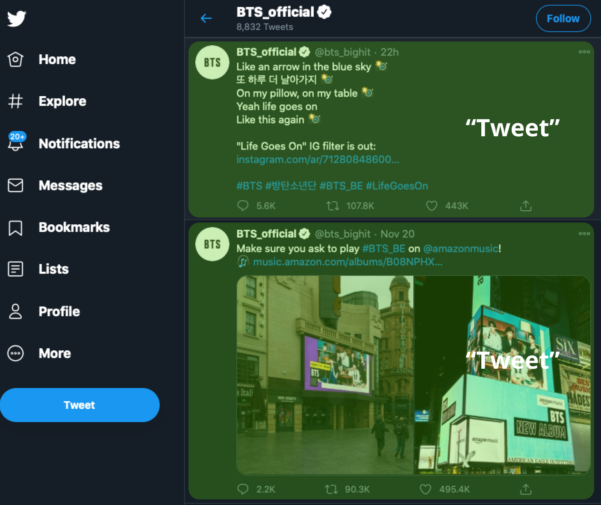
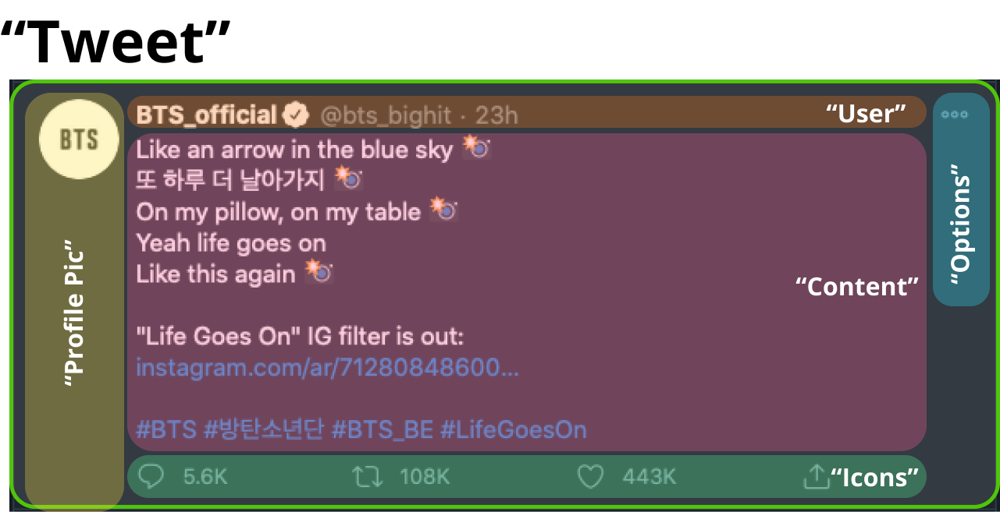

# Should I Use React - What & Why?

The goal of this short README and video is to answer a seemingly simple question: **should I use React in my hackathon project**? In answering this question, Matt will explain what React is, why it exists, and what you might want to consider instead.

For this mini-workshop, **you do not need to know any React**, and really, **you probably don't even need to know how to code**! Everyone is welcome.

## Table of Contents

* [What is React?](#what-is-react)
* [Why does React exist?](#why-does-react-exist)
* [What could I use instead of React?](#what-could-i-use-instead-of-react)
* [So ... should I use it?](#so--should-i-use-it)
* [Wrapping Up](#wrapping-up)
* [Resources &amp; Attributions](#resources--attributions)
## What is React?

React is a **JavaScript library** used to **build user interfaces**. It is **declarative**, **component-based**, and **"learn once, write anywhere"**.

What do those words mean???

* React is a **JavaScript library**. React is a bunch of code written in JavaScript (JS), the programming language that powers the web. Writing code with React is mostly writing code in JS!
* React **builds user interfaces**. Simply put, we use it to build everything the user interacts with on a website: from nice button clicks to data requests and everything in-between.
* React is **declarative**. In other words, we spend time *describing* what our "views" are, and when they should be updated. But, we don't actually write code to update the views - React does that! It's similar to the difference between HTML and C++.
* React is **component-based**. We break down a complicated website into small, reusable, and easy to understand components!
* You **learn React once**, and you can **write it anywhere**. In particular, you can use React with most other web technologies (in particular, it is backend agnostic); you can also use it to make mobile apps with [React Native](https://reactnative.dev/).

If you want a more concrete example, here's a very simple example of a React component, a counter. If you don't know what this means, that's totally fine - we cover it in our tutorials!

```jsx
const Counter = (props) => {
  const [count, setCount] = useState(0);
  const updateCount = () => {
    setCount(count + 1);
  };

  return (
    <div>
      <span>current count: {count}</span>
      <button onClick={updateCount}>add one!</button>
    </div>
  )
}
```

React is often paired with [Node.js](https://nodejs.org/en/) and the [npm ecosystem](https://www.npmjs.com/), though neither are required to use React. Not sure what those are? We cover it in another mini-workshop!

## Why does React exist?

React was made by a team at Facebook to solve a very common problem: building complex web applications is hard! To understand a simple version of the problem they were trying to solve, let's take a look at a different social media network: Twitter.

(shoutout to ACM Hack's [2020 Hackschool](https://github.com/uclaacm/hackschool-f20/tree/main/session-7-intro-react) for providing us with these images)

BTS has taken the world by storm, including my Twitter feed. Here's what it might look like:


Writing the code for a website like this is actually really complex! But, we can note that many parts of the page are pretty similar. Our feed is made up of a bunch of Tweets.



Tweets have shared features, like a username, the tweet body, and the number of likes. It would be cool if we could create a reusable "Tweet" component - that way, we wouldn't have to duplicate our code.

```jsx
<Tweet
  username="qwerhacks"
  body="prepare for (gay) trouble, and make it double"
  likes="420"
/>
```

This is a key part of React: splitting up complicated web pages into small, easily-maintainable components. Each component is self-contained: it has its own data, functionality, and look.

And, the above code could be valid React! Isn't that neat!

Tweets aren't the only component on the page: what about our navigation bar?


Each tab in a navigation bar also has shared features:

* an icon
* some text
* when you click on it, something happens
* a little notification badge

We're not done yet. Let's take a look at one Tweet.


This Tweet can actually has components inside of itself too:

* a "User" component, with a username, if they're verified, etc.
* a "Profile Pic" component, with their profile pic
* an "Options" component, which has a button you can click to expand a menu
* an "Icons" component, with numbers for comments, retweets, likes, and a share button



These components are interactive: clicking on the like button fills up the heart and increments the number! React makes component interactivity easy to model and build.

As you can imagine, complicated websites like Facebook, Twitter, and maybe your project - they all have lots and lots of components, often within each other!

There are many other reasons that React exist, most of them more technical. Understanding this component-based, declarative approach is the most important part! You'll pick up everything else with practice.

## What could I use instead of React?

There are a few broad categories of alternatives.

First, to be clear, **you don't need to use React to make a website**. Good old HTML, CSS and JS will do! You can make lots of great user interfaces with just HTML, CSS and, JS - that's how most of the web was created! If your project is very simple and not very interactive, then this might be a good choice.

Building off of that, you may want to consider a static site generator. These take the component-approach of React, but don't focus at all on interactivity. This is great for things like blogs or websites for a club! Some examples:

* [Jekyll](https://jekyllrb.com/)
* [Hugo](https://gohugo.io/)
* [Eleventy](https://www.11ty.dev/)

React also has many direct competitors in the MV* library space. Popular alternatives include:

* [Angular](https://angular.io/)
* [Vue](https://vuejs.org/)
* [Svelte](https://svelte.dev/)
* [Ember.js](https://emberjs.com/)

React is so popular that there are also frameworks built on top of it! Some popular ones include:

* [Gatsby](https://www.gatsbyjs.com/)
* [Next.js](https://nextjs.org/)

Between React's direct competitors and platforms built on top of React, there are lots of small differences in design philosophy, maintainability, community support, and performance. That being said, this is not *as important* for a hackathon! You'll probably get similar results picking any item out of those lists - so pick one you like, and stick with it!

## So ... should I use it?

The answer is, **it depends**. It depends on your project, it depends on how much experience you have with these technologies, and it depends on your team.

**That being said, a hackathon is one of the best places to try something new!** Don't let being new to React, or web development, be a barrier stopping you from trying out React! It doesn't matter if React is a "perfect fit" for your project, or if you become a "React expert" after QWER Hacks - if React sounds cool, and you want to learn it, then by all means, go for it!!

On top of that, we will have mentors at the hackathon who have used React before (including me) and are more than happy to help you with your project. Feel free to slide into our DMs!

## Wrapping Up

I hope you enjoyed this mini-workshop, and I hope it helped you with your hacking! If you've got any questions about this presentation at all, feel free to reach out to me (matt)! You can find me:

* at the hackathon!
* on the interwebs, at [matt@matthewwang.me](mailto:matt@matthewwang.me)
* [on GitHub](https://github.com/malsf21)

Interested in learning more about React and how you can use it? Take a look at the walkthrough in this repository!

Good luck hacking! I know you'll do great!

## Resources & Attributions

[Matt](https://matthewwang.me) has taught some variant of this workshop (among other React-related ones) several times before; past iterations include:

* [QWER Hacks 2020's Intro to Web Dev with React and Firebase](https://github.com/malsf21/qwerhacks-web-dev-workshop)
* [Learning Lab Crash Course: Intro to React](https://github.com/uclaacm/learning-lab-crash-course-su20/tree/master/07-intro-react)

He'd also like to thank ACM Hack for Hackschool, which covers many intro to web development topics; he borrowed the BTS Twitter photos from their [Hackschool 2020, Intro to React Workshop](https://github.com/uclaacm/hackschool-f20/tree/main/session-7-intro-react).

The contents of this workshop (like the rest of this repository) are dual-licensed under the [MIT License](https://github.com/malsf21/qwerhacks-21-workshops/blob/main/LICENSE) and the [Creative Commons Attribution 4.0 License](https://creativecommons.org/licenses/by/4.0/); feel free to use whichever license suits your purpose better.

I'd love to hear if you found this helpful, or if you have any suggestions! Please send me an email at [matt@matthewwang.me](mailto:matt@matthewwang.me).
